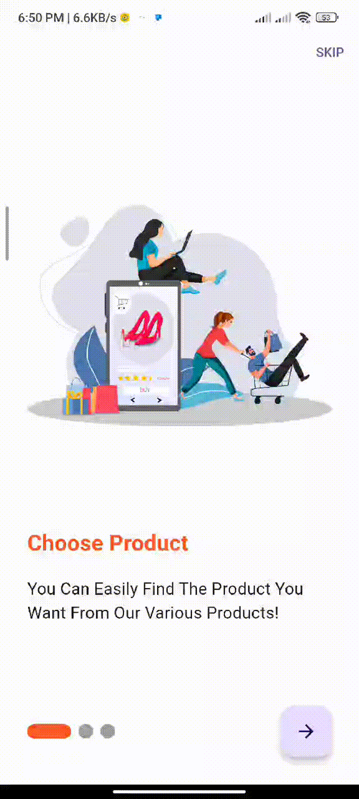
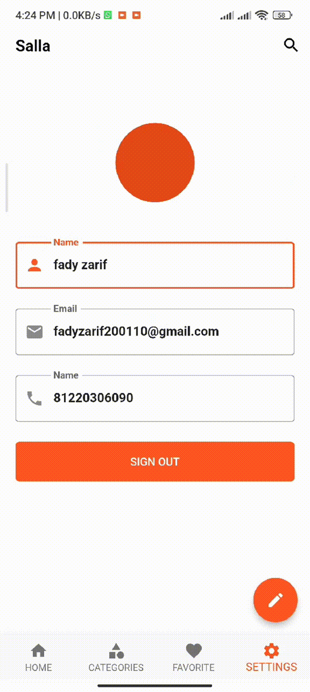
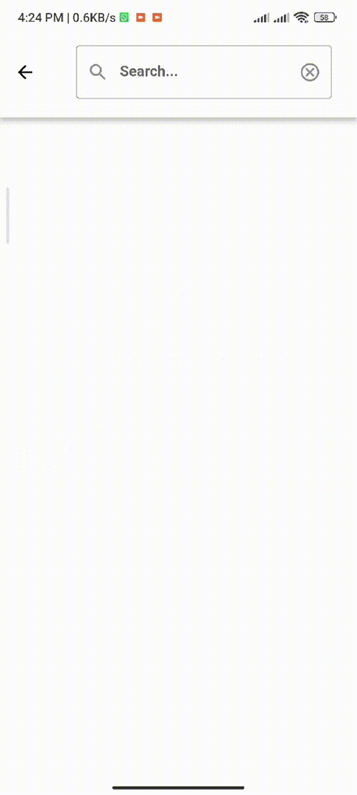

# To-Do List

shopping app that allows the user to navigate through products, add products to favorites and customize his own profile. uses API Integration, Link on Postman: https://www.getpostman.com/collections/3223d639447a8524e38f
To download this app, follow this link: [Shop App](https://www.dropbox.com/scl/fi/d7iplsjr182l6b475rsn1/shop-app.apk?rlkey=jgmhetso3qnl8rakp3oonlnza&dl=0)

## Demo

Here is a demo of the project:

  

## For users:

### Features:
1. Once you install and open the application, you will get to the Onboarding screen which carries information about the application. And this screen is only appearing after the installation.

  

2. Now, You can Login or Sign up. And then, you'll be landed on the Home Screen.

  

3. You can add any product to favorites and it will appear immediately in the Favorites Screen. And then, maybe you want to break my heart to remove product from the list but... it's Already Broken.

  

4. Press Edit Profile if you want to make changes.

  

5. Searching Products

  

## For Developers

### Plugins
smooth_page_indicator
flutter_bloc
bloc
dio
conditional_builder_null_safety
flutter_toast
shared_preferences
carousel_slider
image_picker

### Technologies used in this preoject:
1. Platform: Flutter (version 3.0.0)
2. Programming Language: Dart(version 3.2.0)
3. Editor: Android Studio
4. State Management: Bloc(cubit)

## Flutter Documentation
Follow [this](https://flutter.dev/docs)  link.

## Bloc Documentation
Follow [this](https://bloclibrary.dev/)  link.

 

